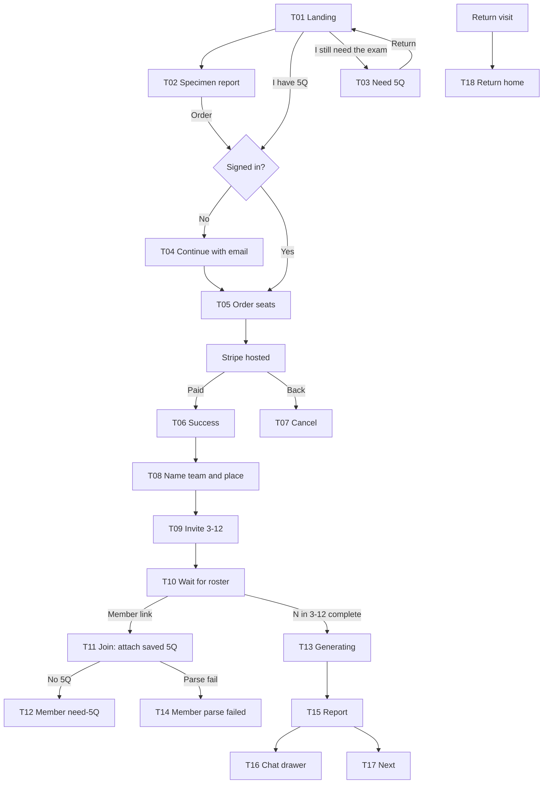

# APEST Teams — screens against current infrastructure

**Status:** Inventory, not implementation. **Date:** 2026-09-01. **Host:** Alan Hirsch only (`tenant_modules.fiveq`). Brad must keep 404ing `/apest-teams`.

This is the screen-by-screen write-up for plugging the **APEST Teams report** into what is already wired. Local already has its own: `APEST-Local-Screens-Spec.md`. Teams has a designed **deliverable** (`APEST Teams Report v2.dc.html`) and almost no designed funnel.

Companions:

- Report constitution: `design-source/apest-teams/REPORT.md` + `APEST Teams Report v2.dc.html`
- Funnel screens designed here: `APEST Teams Funnel.dc.html` (T13, T18)
- Local screens (wired): `design-source/apest-local/INTEGRATION.md`
- Product board: `docs/build/master-checklist/work/apest.md`
- HITL still open: ship report-only vs wait for funnel screens

**Product decisions taken 2026-09-01:** report-only slice (T01–T07 stay stubs); T13 = section skeletons filling in order; T18 = Local S19 bento; funnel chrome = Local structure, Teams-tinted; T17 "Explore a cohort" **dropped** from the report footer.

---

## How to read this

Three kinds of "screen":

| Kind | What it is | Example |
|---|---|---|
| **Route** | A URL the App Router owns | `/apest-teams/checkout` |
| **State of a route** | Same URL, different viewer | `/apest-teams` as marketing vs return home |
| **Overlay** | Sheet/drawer on a route, not a new page | Intake field drawer, person drawer, chat |

The v2 HTML is **one route** with ten sticky-nav sections plus three overlays. Do not split Intake / Team / People into ten Next.js pages.

---

## What the platform already is (as screens and components)

Two Alan products share a **5Q spine**. They do not share a deliverable.

```
5Q Central PDF  →  parse  →  FiveQApestProfile on the signed-in user
                                    │
                    ┌───────────────┴───────────────┐
                    ▼                               ▼
            APEST Local                      APEST Teams
            one person, place,               3–12 people, same
            commission + chat                report + chat drawer
            module: local_commission         module: fiveq
            /apest-local/*                   /apest-teams/*
```

### Tenancy and gates

| Piece | Where | What it does for screens |
|---|---|---|
| `FIVEQ_MODULE` | `src/lib/modules/registry.ts` | Alan-only. `accountNav` → `/apest-teams`. Checkout type `apest_teams`, `$10/person`, quantity 3–12. |
| `LOCAL_COMMISSION_MODULE` | same | Alan-only. `accountNav` → `/apest-local`. Checkout type `apest_local`, `$10` once. |
| `(modules)/apest-teams/layout.tsx` | `canRenderOk("fiveq")` else `notFound()` | Whole Teams tree 404s on Brad. |
| `(modules)/apest-local/layout.tsx` | `canRenderOk("local_commission")` | Whole Local tree 404s on Brad. |
| Nested checkout layouts | `getUser()` → `/auth/signin?redirect=…` | Pay screens require a session. Local also auths setup / commission / place-reading. |
| Shared → module import rule | lint | `/account/*` may **not** import `@/modules/fiveq`. Account uses `FiveQAssessmentPanel` (fetch-only duplicate). Teams UI lives under `src/modules/fiveq/**`. Local may import fiveq. |

### Commerce (already generic)

| Piece | File | Screens it supports |
|---|---|---|
| Stripe session | `src/app/api/custom/checkout/stripe/session/route.ts` | Posts `type: "apest_teams"` + `quantity`. |
| Quantity bounds | `src/lib/stripe/checkout-quantity.ts` | 3–12 seats, metadata key `seats`. |
| Paid lookup | `src/lib/stripe/paid-module-checkout.ts` | `hasPaidModuleCheckout({ checkoutType: "apest_teams" })` — buyer paid. **Not a team object.** |
| Credit grant | `src/modules/fiveq/register.ts` | Stub: `{ ok: true, data: { id: "apest_teams", created: false } }`. Webhook does not create a roster. |
| Price env | `STRIPE_PRICE_APEST_TEAMS` | Unset in Production. Checkout cannot complete on customer DNS until it exists. |

Stripe-hosted card UI is **not** a screen we design. Same as Local S05 → Stripe → S06/S07.

### Agent (already Local; Teams reuses)

| Piece | File | Teams use |
|---|---|---|
| Chat shell | `ApestLabChatShell` | Mount **in a Sheet** on the report. Do not register a second agent slug. |
| Stream / generate routes | `(modules)/api/local-commission/*` | Teams adds a **team context block** (N profiles + computed layer). INTERPRETED essays and chat only. |
| Voice / RAG | `APEST_LAB_SYSTEM_PROMPT` + File Search | Same books. Practices-only guardrail (refuse hire/fire). |
| Introduce drawer | `ApestLabIntroduceDrawer` | Local-only (place brief). Teams chat does not collect a street. |

### 5Q ingest (the membership store)

One profile per signed-in user. Nothing yet gathers 3–12 into a team.

| Piece | File | Screen it already is |
|---|---|---|
| Contract | `src/modules/fiveq/schemas/fiveq-apest-profile.ts` | The 10 SOURCE fields the report transcribes (scores 0–50, ranks, primary/secondary, combination + rarity, reportDate, optional benchmarks). |
| Parse | `parse-vocational-report.ts` + `extract-pdf-text.ts` | PDF → profile. |
| Persist / read | `fiveq-apest-ingest.service.ts` | `GET/POST /api/custom/account/apest` (+ `/import`, `/manual`). |
| Hooks | `use-fiveq-apest.ts` | `useFiveQApestProfile`, `useImportFiveQApestPdf`, `useSaveFiveQManualScores`. |
| Module profile UI | `FiveQApestProfileView`, `FiveQApestUpload` | Ranked bars + PDF dropzone. |
| Shared account UI | `src/components/account/FiveQAssessmentPanel.tsx` | Same job on `/account/assessment` without importing the module. |
| **Kill path** | `useSaveFiveQManualScores`, `/apest-local/setup/5q?manual=1` | Product call 2026-08-31: 5Q Central PDF only. No-profile is an invitation to take the exam. |

Roster fields **not** on the PDF (must be collected on the team, not the profile): display role, years in role, staff vs volunteer, **formal authority**, team name, place.

### Account "dashboard" surfaces already wired

These are how a signed-in Alan user finds APEST today. Teams must not invent a second account home; it should deep-link these and add a Teams return-home.

| Screen | Route | Components | Today |
|---|---|---|---|
| Account home | `/account` | `UserDashboardV2`, `UserDashboardAPESTCard` | Primary gift pill + "Open APEST Local" / 5Q exam link. Does **not** mention Teams. |
| Account sidebar | (chrome) | `UserDashboardSidebar` | `accountNav` for Local **and** Teams when each module can render. |
| Assessment | `/account/assessment` | `FiveQAssessmentPanel` + `useUserAssessmentsList` | Upload/replace 5Q PDF; "Open APEST Local"; list of other assessments. **This is the member's 5Q locker.** Teams membership means "attach *this* saved profile to the roster," not a pile of buyer-uploaded PDFs. |
| Pricing matrix | `/pricing` | `pricing-feature-matrix` APEST Local row | Leader skip for Local. No Teams row yet. |

---

## APEST Local — already a complete screen set

Wired 2026-08-31 from `design-source/apest-local/`. Treat this as **infrastructure to copy patterns from**, not to rebuild.

| Local | Route | Component | Job |
|---|---|---|---|
| S01 Landing | `/apest-local` (unsigned) | `flow/landing.tsx` | Sell $10, 5Q already taken |
| S02 Specimen | `/apest-local/specimen` | `flow/specimen.tsx` | Proof: commission artifact |
| S03 Need 5Q | `/apest-local/need-5q` | `flow/need-5q.tsx` | Outbound to 5Q Central, no charge |
| S04 Continue | `/apest-local/continue` | `flow/continue.tsx` | Product-branded email before pay |
| S05 Order | `/apest-local/checkout` | `flow/order.tsx` | One SKU; Leader skip |
| S06 / S07 | `checkout/success`, `cancel` | pages | Commerce close / resume |
| S08–S10 5Q | `/apest-local/setup/5q` | `flow/setup-5q.tsx` | Bring PDF (manual scores still live — kill) |
| S11 Place | `/apest-local/setup/place` | `flow/name-place.tsx` | Named place before commission |
| S12 / S13 Chat | `/apest-local?view=chat` | `flow/workspace.tsx` → `ApestLabChatShell` | Studio. Chat is **not** the Local deliverable |
| S14–S16 Commission | `/apest-local/commission` | `flow/commission.tsx`, artifact, debrief | **Local deliverable** |
| S17 / S18 NIR | `/apest-local/place-reading` | `flow/nir.tsx` | Optional Brad $10 |
| S19 Return home | `/apest-local` (entitled) | `ApestLocalReturnHome` | Replaces landing for purchasers |

Shared chrome for those screens: `flow/chrome.tsx` (`NetworkBand`, `FlowPaper`, `FlowCtaLink`, `SetupProgress`, `FlowError`). Teams order/success today **do not** use this chrome (plain `Card` + muted text). Port Teams commerce onto the same paper.

Entitled Local viewer: `getApestLocalViewer()` + `local-commission-eligibility.service.ts` (Leader **or** paid `apest_local` session) → redirect missing 5Q/place.

---

## APEST Teams — what is live today

Four routes. No team, no roster, no report, no chat.

| Live route | File | What it is | Gap vs the product |
|---|---|---|---|
| `/apest-teams` | `apest-teams/page.tsx` | Three paragraphs + "Order a team" | Not S01. No specimen, no need-5Q, no entitled return-home. Production still 404s into `(public)/[orgSlug]` until this tree is what Host matches. |
| `/apest-teams/checkout` | `ApestTeamsOrder` | Seat select 3–12, Stripe | Works as commerce. No NetworkBand, no "what you are buying is a report," no Leader skip. Unsigned → generic `/auth/signin`, not a Local-style continue page. |
| `/apest-teams/checkout/success` | page | "You're in. Back to APEST Teams." | Sends them to the **buy** page. Next required step is name the team / invite, not another landing. |
| `/apest-teams/checkout/cancel` | page | Resume checkout | Fine as S07. |

Credit grant is a no-op. Paying does not create a team id, so there is nowhere for success to go.

---

## Teams screens to build

Order is the funnel a buyer walks, then the report they paid for. **Visual source:** T15–T16 (report + overlays) in `APEST Teams Report v2.dc.html`; T13 and T18 in `APEST Teams Funnel.dc.html`. T01–T12, T14, T17 are **undesigned**; specified here as routes/states so they plug into Local/Stripe/account instead of becoming a second visual language.



**Report-only slice** (chosen): skip T01–T07 polish; start at a staff-seeded roster → T13 → T15–T16 → T18. Funnel stays listed so we do not pretend checkout is the product.

### T01 — Landing (the sell)

**Route:** `/apest-teams` (unsigned / unpaid)
**Reuse:** Local S01 pattern (`flow/landing.tsx`, `copy.ts`), not the current stub page.
**New:** Teams copy. Hero is **a single INTERPRETED sentence set large** (product call 2026-09-01), not a cropped artifact. Price is `$10 per person`, 3–12, totals $30–$120. Primary: Order a team. Secondary: I still need the assessment. Tertiary: See a sample report.
**Do not:** fold Local's street-commission story into this page. Two products.

### T02 — Specimen report (proof)

**Route:** `/apest-teams/specimen`
**Reuse:** Local S02 is a reading page + rail. Same shell, different artifact.
**New:** Public Redemption Hill crop — **two sections then a wall** (product call 2026-09-01): Team picture and one INTERPRETED paragraph, then a paywall band. Download PDF disabled.
**Success:** They know they are buying a systems report, not a group chat.

### T03 — Need 5Q (buyer)

**Route:** `/apest-teams/need-5q`
**Reuse:** `flow/need-5q.tsx` almost as-is (outbound 5Q Central + UTM `utm_medium=apest-teams`).
**Difference:** Copy says each **member** will bring a 5Q, not that the buyer uploads twelve PDFs.

### T04 — Continue with email

**Route:** `/apest-teams/continue`
**Reuse:** `flow/continue.tsx` + `NetworkBand`. Today checkout layout dumps to `/auth/signin`.
**Job:** Attach Stripe to a user in this product's paper, then T05.

### T05 — Order (seats)

**Route:** `/apest-teams/checkout` — **exists**
**Reuse:** `ApestTeamsOrder` + Stripe quantity. Restyle with `flow/chrome` like `ApestLocalOrder`.
**Add:** What they are buying (on-screen report + PDF, chat secondary). Line item `$10 × N`. Leader skip if that SKU is bundled later (not decided). Error "Could not start checkout."
**Not a screen:** Stripe card form.

### T06 — Checkout success

**Route:** `/apest-teams/checkout/success` — **exists, wrong next step**
**Reuse:** Local S06 tone ("You're in.").
**Change:** Primary **Name this team** → T08, not "Back to APEST Teams." Webhook-failure variant (paid, no team row yet) like NIR/Local.

### T07 — Checkout cancelled

**Route:** `/apest-teams/checkout/cancel` — **exists**
**Reuse:** Local S07. Keep.

### T08 — Name the team and the place

**Route:** `/apest-teams/setup/team`
**Reuse:** Local S11 form energy (`name-place.tsx`, `SetupProgress`) — different fields.
**Collect (not on 5Q PDF):** team name, place, grain of the team (staff / board / plant / other). Buyer is participant zero: their **role, tenure, staff/volunteer, formal authority**.
**Progress:** Step 1 of 2 — Team. Step 2 is roster.
**Schema:** new (named SQL, not this repo's DDL). No table today.

### T09 — Invite the rest

**Route:** `/apest-teams/setup/roster`
**Reuse:** none in-repo. Closest is account Network, which is the wrong product.
**Job:** Seats paid = N. Buyer already occupies one. Invite N−1 by email (or share a join link). Each invitee must sign in and attach **their** saved 5Q.
**States:** empty invites, some pending, copy link, resend. Cannot generate the report under 3 complete 5Qs.

### T10 — Wait for the roster

**Route:** `/apest-teams` or `/apest-teams/setup/roster` entitled **wait state**
**Job:** "3 of 8 reports in. Generate when at least 3 are attached, up to 12." Buyer can sit here.
**Do not:** let the buyer upload other people's PDFs as the product.

### T11 — Member join (attach saved 5Q)

**Route:** `/apest-teams/join/[token]`
**Reuse:** `useFiveQApestProfile` + `FiveQApestProfileView`. If profile exists: confirm "This is my 5Q" + roster metadata (role, tenure, staff/volunteer, formal authority). If missing: T12.
**This is the membership screen.** The 5Q is the one on `/account/assessment`.

### T12 — Member need-5Q

**Route:** same join URL, no-profile state
**Reuse:** T03 / Local S03. Invite to 5Q Central; return to join link. Then upload on account or a thin PDF dropzone that writes the **same** `GET /api/custom/account/apest` store (`useImportFiveQApestPdf`).
**Do not:** open a manual five-score form.

### T13 — Generating — **designed**

**Route:** `/apest-teams/report` first load, or `/apest-teams/report/generating`
**Visual:** `APEST Teams Funnel.dc.html`, screen T13.
**Shape:** the ten report sections listed in order, each with its layer label, filling sequentially. SOURCE/COMPUTED rows resolve fast and read "reading"/"computing"; Meaning and Practices take roughly 3× as long and read "writing" — the wait visibly belongs to the essays, not the arithmetic. Overall percent, stale-report note carried through, open button inert until 100%.
**Job:** Deterministic COMPUTED layer (means, tiers, distances, crosstab) then INTERPRETED essays from the Local agent + team context.
**Not the model:** SOURCE transcription and COMPUTED arithmetic.

### T14 — Member parse failed

**Route:** join / account upload error state
**Reuse:** Local S10 recoveries **minus** "enter five scores": try another PDF, go to 5Q Central. Paid buyer must not be stranded; a member with a bad PDF can retry without blocking others.

### T15 — Report (the paid deliverable)

**Route:** `/apest-teams/report` (or `/apest-teams` once generated — prefer a stable report URL)
**Visual:** `APEST Teams Report v2.dc.html`
**Same report for every participant.** No buyer edition.

This is the Teams **dashboard**. Chat is T16 on this page. Next is T17 in the footer. Breakdown: [Report regions](#report-regions-one-route).

### T16 — Chat drawer (not a page)

**On:** T15
**Reuse:** `Sheet` (`src/components/ui/sheet.tsx`) + `ApestLabChatShell` (or a thinner composer that shares `use-apest-lab-chat`). Suggested prompts from the HTML, including the guardrail case "Who should we let go?"
**New:** team context block in the existing Local API. Label answers INTERPRETED.
**Do not:** `/apest-teams/chat` as a standalone product.

### T17 — Next (footer actions)

**On:** T15 footer
**Actions:** Re-run in 12 months · Open the conversation (opens T16). **"Explore a cohort" dropped 2026-09-01** — no destination exists and we will not fake one.
**Infrastructure:** re-run is a **new report row** on the same team (stale 5Qs flagged again), not a new Stripe purchase unless product later says so.

### T18 — Return home (purchaser / member) — **designed**

**Route:** `/apest-teams` when entitled and a report exists
**Visual:** `APEST Teams Funnel.dc.html`, screen T18. Local S19 bento (`ApestLocalReturnHome`), Teams-tinted.
**Cards:** current report (cropped bar strip, open + PDF) · roster completeness with the stale member flagged amber · your 5Q chips linking `/account/assessment` · conversation on the dark band · re-run framed as a new reading on the same team.
**Never sell `$10 × N` again** — no price appears on this screen.
**Account sidebar** already points here via `FIVEQ_MODULE.accountNav`.

---

## Report regions (one route)

v2 `data-screen-label` values. Sticky nav: Intake → Team → People → Coverage → Concentration → Authority → Dynamics → Meaning → Practices → Limits.

Port via stitch-react only after T15 is the integration target. Until then, build as module components under `src/modules/fiveq/components/report/`.

| Region | Layer | What it shows | Plug into |
|---|---|---|---|
| **Chrome** | — | Team name, "Leadership Team · N · Generated DATE", place, Download PDF, Show provenance, Method accordion | New `ReportChrome`. PDF = print stylesheet or server PDF of the same sections. |
| **R1 Intake** | SOURCE | N of N received / parsed / fields. Stale >3 years flagged. Click name → **Intake drawer** | `FiveQApestProfile` × N. Drawer is SOURCE only (10 fields). Reuse ranked scores from `FiveQApestProfileView`; do not show Movemental deltas here. |
| **R2 Team** | COMPUTED | Pattern sentence. Five bars: team mean /50, population tick (A21 P23 E25 S27 T28), delta, hatch if below pop. Tiles: capacity vs expected, range, S-in-combinations, generalist count | New computed lib (no model). Do not put means in the agent prompt as if they were invented. |
| **R3 People** | SOURCE + computed spread | Table: name, role/tenure, combination + rarity, ranked chips, authority mark, staff/volunteer, date, spark. Click → **Person drawer** (raw, Δ pop, share of total, ranked, spread) | Roster metadata (T08/T11) + profile. Person drawer ≠ intake drawer. |
| **R4 Coverage** | COMPUTED then INTERPRETED | Tiers STRONG / PRESENT / THIN / ABSENT (top-two rules in REPORT.md). Hover: what the function *does*. Essay from agent | Tier function is code. Essay is the Local agent. |
| **R5 Concentration** | SOURCE types + COMPUTED matrices | Combination types, top-two matrix, raw heatmap (outline = top two), clustering essay | Same split. |
| **R6 Authority** | COMPUTED | Function × top-two × formal authority. Line only where both true. Essay: who reaches the decision | Needs formal-authority boolean from roster. |
| **R7 Dynamics** | COMPUTED | Euclidean distance on five raw scores. Closest / furthest / all pairs. Essay: distance only, no character | Code + agent. |
| **R8 Meaning** | INTERPRETED | Dark band. *Forgotten Ways* ch. 6, *Permanent Revolution*, 5Q | Agent. Never impersonate Alan. |
| **R9 Practices** | INTERPRETED | Three numbered practices. **No hire/fire/remove** | Agent + same guardrail in T16. |
| **R10 Limits** | FIXED template + COMPUTED fills | Strong / suggestive / not-established. No published **team** benchmark | Template in code; substitute named specifics. |
| **Provenance rail** | chrome | Toggle paints SOURCE / COMPUTED / INTERPRETED | CSS/data attributes on each block. Method accordion copy from HTML. |
| **Intake overlay** | SOURCE | Right sheet, 10 transcribed fields, stale banner | `Sheet` + profile. |
| **Person overlay** | mixed | Raw + Δ pop + share | `Sheet` + computed row for that member. |
| **Chat overlay** | INTERPRETED | T16 | `Sheet` + `ApestLabChatShell`. |
| **FAB** | chrome | "Ask about this report" | Opens T16. |

Population means are **constants** (5Q, ~150k tests, /50). They are also printed on the PDF; Intake may show them as SOURCE constants, Team uses them as COMPUTED ticks.

---

## Proposed component map (Teams module)

Keep new UI in `src/modules/fiveq/**`. Shared account stays fetch-only.

| Component (proposed) | Kind | Reuse |
|---|---|---|
| `ApestTeamsLanding` | T01 | Clone structure of `ApestLocalLanding` |
| `ApestTeamsSpecimen` | T02 | Clone `flow/specimen.tsx`; body is report crop |
| `ApestTeamsNeed5q` | T03 / T12 | Clone `flow/need-5q.tsx` |
| `ApestTeamsContinue` | T04 | Clone `flow/continue.tsx` |
| `ApestTeamsOrder` | T05 | **Exists** — restyle with `flow/chrome` |
| Success / cancel pages | T06 / T07 | Exist — retarget success |
| `ApestTeamsSetupTeam` | T08 | Clone `name-place.tsx` fields |
| `ApestTeamsRoster` | T09 / T10 | New |
| `ApestTeamsJoin` | T11 / T12 / T14 | `useFiveQApestProfile` + `FiveQApestProfileView` + PDF import |
| `ApestTeamsGenerating` | T13 | New from `APEST Teams Funnel.dc.html` |
| `ApestTeamsReturnHome` | T18 | New from `APEST Teams Funnel.dc.html`; structure of `ApestLocalReturnHome` |
| `ReportChrome` | T15 | New from HTML |
| `ReportSectionIntake` … `Limits` | T15 | One component per region |
| `ComputedLayer` (lib, not UI) | — | Means, tiers, distances, crosstab |
| `IntakeSourceSheet` | overlay | `Sheet` + SOURCE fields |
| `PersonSheet` | overlay | `Sheet` + computed row |
| `ReportChatSheet` | T16 | `Sheet` + existing lab chat |
| `FiveQAssessmentPanel` | account | **Exists** — member locker; do not duplicate in shared |

Local `flow/chrome.tsx` currently lives in `local-commission`. Teams must not import `@/modules/local-commission` from a shared file; **fiveq may import local-commission** only if we accept that coupling. Cleaner: lift `NetworkBand` / `FlowPaper` into `src/modules/fiveq/components/flow/` (copy) or a tiny shared `src/components/` only if **every tenant** should ship that paper. Prefer copy-inside-fiveq until both products share a third module. Chat is the exception: same agent, so fiveq report sheet should call the existing Local chat API (module → module is allowed).

---

## Data that is not a screen

No DDL from this repo. Request via `_migration/SCHEMA-REQUESTS.md` before T08.

Needed to render T15:

- **Team:** org, buyer user id, Stripe session / seat count, name, place, generated_at, report payload (computed JSON + interpreted essays).
- **Member:** user id, role, tenure, staff/volunteer, formal authority, pointer to that user's `FiveQApestProfile` (already on `user_assessments` / account apest).
- **Invite token:** email, expiry, which seat.

Until that exists, a report-only slice can use a fixture roster (Redemption Hill) to port T15 against `ComputedLayer` + frozen INTERPRETED copy from the HTML.

---

## What not to build

| Surface | Why |
|---|---|
| Manual five-score intake | Product call. Kill on Local setup too. |
| Second agent slug | Same Local agent + team context. |
| Buyer-uploaded zip of other people's PDFs | Membership is saved profiles. |
| Hire/fire recommendations | Guardrail. Chat refuses. |
| In-app Likert quiz / team radar | Old Brad note; not this product. |
| Cohort explorer | Dropped 2026-09-01. No destination. |
| Stripe card UI, 5Q Central exam, NIR interiors | Hosted elsewhere. |
| Ten routes for ten report sections | One report URL + sticky nav. |
| Teams on Brad | `fiveq` row off → 404. |
| Shared import of `@/modules/fiveq` | Lint. Account already has `FiveQAssessmentPanel`. |

---

## Build order (report-only slice, chosen)

Fixture or named SQL roster → `ComputedLayer` → T15 regions + overlays → T16 chat drawer with team context → T13 generating → T18 return home replaces the stub home for entitled users → PDF. Leave T01–T07 as the current stubs.

**T15 is the product.** Checkout without this page is an incomplete SKU.
